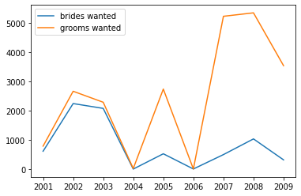

The code and data in this repository are a preliminary step towards the final objective of understanding the structure, trends, relevance,and success of matrimonial advertisements in the Indian context, throught this project. While this repository currently contains advertisements for prospective brides and grooms from the year 2001 to 2009, and 2014, the final project will also have data for 2010, 2011, 2012, and 2013.These years are slightly difficult to scrape owing to changes in the website. The data for grooms can be found under ```grooms_data``` in the folder ```data```, and the data for brides can be found under ```brides_data``` in the folder ```data```.

The code is written in Python 3.9.10 and all of its dependencies can be installed by running the following in the terminal (with the requirements.txt file included in this repository):

                         pip install -r requirements.txt
                         
Then, you can import the analysis and plot_num_ads module located in this repository to reproduce the analysis in the project that this code supplements (in a Jupyter Notebook, like README.ipynb in this repository, or in any other Python script):


```python
import plot_num_ads
```

This module primarily plots the number of advertisements for brides and grooms across all years. This can help us understand how these ads and their volumnes have changed with respect to brides and grooms in the context of newspapers. Once you import the above module, you can use its plot function to reproduce the figure comparing number of advertisements across years.


```python
plot_num_ads.plot_fig()
```


    

    


### Findings:
This shows that the number of advertisements for grooms and brides move in the same direction (this could also be a function of problems in scraping). Moreover, it shows that the number of advertisements for grooms peaked heavily after 2006. While the time would have to be examined (as to why this is observed only after 2006 and not before), there is anecdotal evidence that there has traditionally been more societal pressure for women to get married, and this finding supports this at a very rudimentary level. Of course, a more thorough qualitative analysis is required to make any claim.

You can then import the analysis module to delve deeper into some of the actual analysis of the project. This module produces analysis for a single data file. Hence, you could input any data file from the ```data``` folder using the commands below. The below functions are performed on the advertisements seeking brides in the year 2008. A similar analysis can be repreduced for all years.


```python
import analysis
```


```python
data = analysis.word_to_count('data/brides_data/brides-wanted_2008.csv')
analysis.counts_data(data)

```


<table border="1" class="dataframe">
  <thead>
    <tr style="text-align: right;">
      <th></th>
      <th>word</th>
      <th>count</th>
    </tr>
  </thead>
  <tbody>
    <tr>
      <th>0</th>
      <td>nurse/doctor</td>
      <td>1</td>
    </tr>
    <tr>
      <th>1</th>
      <td>mba</td>
      <td>2546</td>
    </tr>
    <tr>
      <th>2</th>
      <td>ma</td>
      <td>255</td>
    </tr>
    <tr>
      <th>3</th>
      <td>kashyap</td>
      <td>300</td>
    </tr>
    <tr>
      <th>4</th>
      <td>rajput</td>
      <td>1161</td>
    </tr>
    <tr>
      <th>...</th>
      <td>...</td>
      <td>...</td>
    </tr>
    <tr>
      <th>9140</th>
      <td>processing</td>
      <td>1</td>
    </tr>
    <tr>
      <th>9141</th>
      <td>0030</td>
      <td>1</td>
    </tr>
    <tr>
      <th>9142</th>
      <td>accoutancy</td>
      <td>1</td>
    </tr>
    <tr>
      <th>9143</th>
      <td>11:50</td>
      <td>1</td>
    </tr>
    <tr>
      <th>9144</th>
      <td>jagdeepkumar</td>
      <td>1</td>
    </tr>
  </tbody>
</table>
<p>9145 rows × 2 columns</p>
</div>


### Findings
While a lot of junk words appear, upon sorting this table we observe that words such as mba, ma, kashyap (a community), rajput (a community) appear several times. This finding is an indication of how these advertisements can be explained along dimensions of occupation, caste, and gender.

You can also run the below commands to reproduce the other plots in the project.


```python
analysis.final_func('data/brides_data/brides-wanted_2008.csv')
```


    

    


    

    


The above commands can easily be run for any of the files from the data folder to reproduce other analyses.


### Findings
These plots are very informative. They tell us that Sikh, which is a religious community in northern india, is the most frequently used proper noun, and mba ia the most used three letter word. This gives another strong signal towards the heavy use of caste and occupation in these ads. Moreover, it would be interesting to explore why 'usa' is accuring almost as frequently as india.


  
